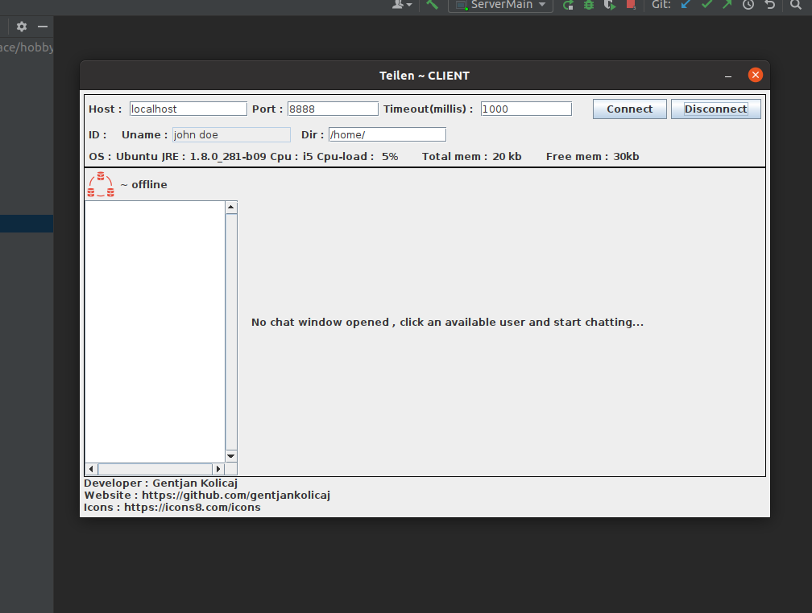
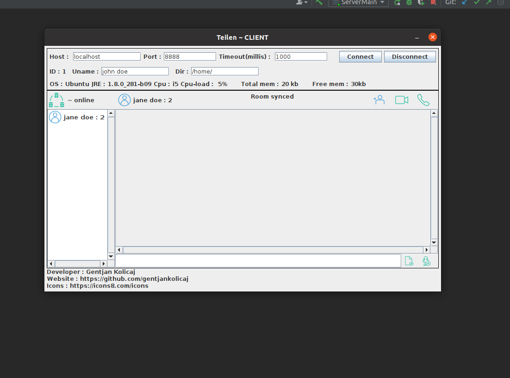
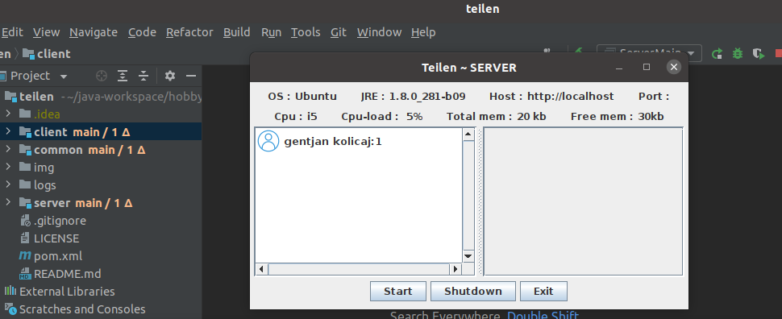
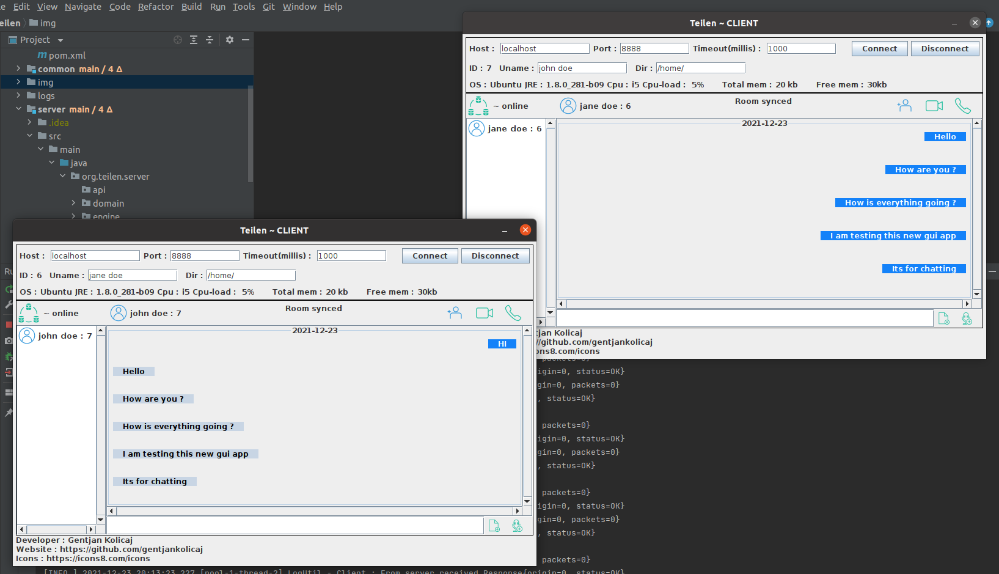

# teilen

Desktop communication application with sockets.It also has messaging, file transfer.

 Architecture : client-server
 Programing language : Java 11
 Other frameworks/libs : Sockets , swing , lombok , mapstruct , apache commons , log4j ,
 Webcam capture :
<groupId>com.github.sarxos</groupId>
<artifactId>webcam-capture</artifactId>
<version>0.3.12</version>

# Client :

 

# Server :

 

# Client-server :

 

# Multiple clients :

